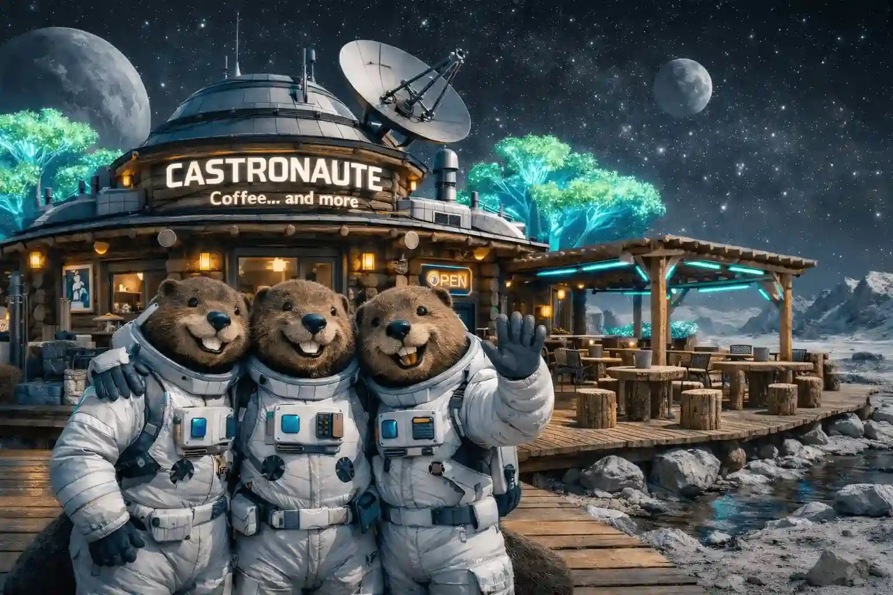

# 🚀🦫 Castronautes Coffee  
### The Intergalactic Beaver Coffee Shop  

Projet réalisé dans le cadre d’un **challenge optionnel proposé par notre SWE à Holberton School**.  
Objectif : renforcer les bases en intégration HTML/CSS/JS à travers un projet créatif et professionnel.

---

## 🌌 Concept

**Castronautes Coffee** est le premier coffee shop intergalactique tenu par des castors explorateurs de l’espace.  
L’univers graphique mélange :

- 🌲 Nature / Bois / Artisanat  
- 🌠 Cosmique / Galaxies / Exploration spatiale  

L’idée : créer un site vitrine immersif, responsive et professionnel, tout en respectant des contraintes techniques strictes.

---

## 🎯 Objectifs pédagogiques

- Maîtriser la structure sémantique HTML5
- Organiser un CSS propre et structuré
- Utiliser Flexbox et/ou CSS Grid
- Implémenter un JavaScript Vanilla pertinent
- Concevoir un site **100% responsive**
- Respecter un cahier des charges précis

---

## 🛠 Contraintes techniques (strictes)

- ✅ HTML5  
- ✅ CSS3  
- ✅ JavaScript 
- ❌ Aucun framework  
- ❌ Aucun back-end  
- ❌ Aucune base de données  
- ❌ Aucun système d’authentification  

Tout le contenu est codé en dur.

---

## 📂 Structure du site

Le site est composé de plusieurs pages reliées entre elles, avec :

- Header commun
- Navbar responsive (menu burger mobile)
- Footer commun

### 🔹 Pages disponibles

- 🏠 Home  
  https://gwenp88.github.io/project-castronautes_coffee/

- 📋 Menu  
  https://gwenp88.github.io/project-castronautes_coffee/menu.html

- 📬 Contact & Équipage  
  https://gwenp88.github.io/project-castronautes_coffee/contact.html#equipe

---

## 🧱 Détails des pages

### 🏠 Home

La page d’accueil pose l’univers du projet et sert de porte d’entrée immersive.

- **Hero Header**
  - Objectif : annoncer immédiatement le concept “coffee shop intergalactique”
- **Section “Concept / Lore”**
  - Présentation narrative : *Pourquoi des castors dans l’espace ?*
  - Mise en scène du ton et de l’identité visuelle
- **Parcours utilisateur**
  - Accès clair vers les pages clés (Menu / Contact / Équipage)
  - Contenu pensé pour être lisible et agréable sur mobile comme sur desktop

---

### ☕ Menu

Page orientée “vitrine produits”, pensée comme un menu de coffee shop… version galaxie.

- **Grille de produits**
  - Affichage sous forme de cartes (cafés / snacks spatiaux)
- **Mise en page moderne**
  - Utilisation de **CSS Grid** pour structurer la grille
  - Adaptation responsive : nombre de colonnes et tailles de cartes qui évoluent selon l’écran
- **Focus UI/UX**
  - Hiérarchie visuelle (titres, prix, descriptions courtes)
  - Mise en avant de l’identité graphique : ambiance “bois” + touches cosmiques

---

### 📬 Contact & L’équipage

Page mixte : conversion (contact) + storytelling (l’équipe).

- **Formulaire de contact (visuel + validation JS)**
  - Champs présents (ex : nom, email, message…)
  - **Vérifications JavaScript** côté front (ex : champs requis, format email)
  - Objectif : simuler un vrai formulaire pro même sans envoi réel
- **Section “L’équipage”**
  - Présentation des castors (membres de l’équipe)
  - Cartes/portraits + rôle/fonction pour renforcer l’univers

---

## 🌗 Mode Jour / Mode Nuit (overlay d’ambiance)

Le site intègre un **overlay interactif** qui bascule l’expérience visuelle :

- **Mode Jour : “Coffee Shop”**
  - Ambiance chaleureuse, bois/nature, atmosphère conviviale
- **Mode Nuit : “Agence spatiale”**
  - Ambiance plus “mission secrète” / spatial-tech
  - Le site devient une base spatiale “non déclarée” (changement de mood + immersion)

Fonctionnement général :
- Le basculement modifie l’ambiance globale (style, atmosphère, lisibilité, textes...)
- L’objectif est d’ajouter une couche narrative + une vraie interaction front-end en **JavaScript**
- Cohérence maintenue sur toutes les pages (expérience continue)

---

## 📱 Responsive Design

Le site est pensé **mobile-first** et s’adapte à tous les formats :

- 📱 Mobile
- 📲 Tablette
- 💻 Desktop

Éléments responsive importants :
- **Navbar responsive** : navigation entre les pages + transformation en **menu burger** sur petits écrans
- **Grilles adaptatives** : colonnes qui se réorganisent selon la largeur
- **Typographies, espacements et médias** ajustés pour éviter tout “cassage” sur mobile
- Compatibilité du **mode jour/nuit** avec le responsive (overlay et styles adaptés)

---

## 🎨 Intentions design

- Univers hybride bois + cosmos
- Ambiance immersive
- Identité visuelle forte
- Expérience utilisateur fluide
- Site vitrine crédible malgré le thème décalé

---

## 🚀 Pourquoi ce projet est important ?

Ce projet est un terrain d’entraînement complet pour :

- Consolider les bases front-end
- Travailler la rigueur technique
- Développer sa créativité
- Construire un projet présentable en portfolio

---

## 👩‍💻 Auteur

**Gwenaelle PICHOT**  
Student at Holberton School   

---

🦫✨ *Parce que même les castors méritent leur café interstellaire.*
